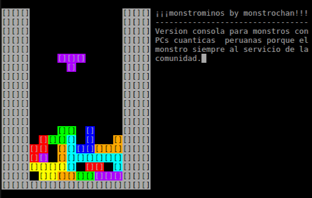

:octocat::octocat::octocat: To read the english version of this document [click here](./README.md). :octocat::octocat::octocat:

[](http://monstrochan.org/l/)
- - -
# monstrominos
#### *monstrominos* por *monstruosoft* por *monstrochan*

*monstrominos* es un juego de tetrominos (clón de Tetris) que surge como respuesta al Reto de la toja azul en [monstrochan.org](http://monstrochan.org/l/).  Esta es una versión en desarrollo que ya se puede jugar pero a la que aún le faltan muchas características.


El código está organizado en tres secciones independientes: *núcleo*, *lógica* y *controles/gráficos*.

## Núcleo
Un conjunto mínimo de funciones que usan aritmética de punteros para realizar las acciones básicas como colocar las piezas en el campo de juego, checar si hay líneas completas y eliminarlas. El tamaño del campo de juego está fijo como un arreglo de 24 `uint16_t` que representan 24 líneas de 16 columnas cada una. Aunque estos valores están fijos en el código del núcleo, son suficientes para representar el tamaño del campo de juego de cualquier implementación típica de un clon de Tetris.

## Lógica
Aquí es donde se desarrolla el modo de juego. La implementación de la lógica incluída en este repositorio es sólamente una forma posible de definir el modo de juego. Vale le pena mencionar que es posible escribir diferentes implementaciones de la lógica y aún hacer uso de las funciones del núcleo para actualizar el campo de juego. La implementación de la lógica que se incluye en el repositorio aún puede ser mejorada pero de momento ya incluye soporte básico para *wall kicks* y *floor kicks* así como para algunos *spins* comunes -pero no todos están soportados actualmente.

También se debe tener en cuenta que debido a la forma mínima en que están construidas las funciones del núcleo, la parte de la lógica debe manejar el uso de color. La lógica incluída en el repositorio contiene un ejemplo opcional para el uso de colores.

## Controles y gráficos
La lógica incluída en el repositorio es independiente de la librería que se use para los controles y los gráficos, esto permite usar la lógica con distintas librerías de funciones. El repositorio incluye dos diferentes versiones del juego, una usando [Allegro 5](http://liballeg.org/) y una versión de consola usando *ncurses*. Ambas versiones usan el mismo núcleo y la misma lógica, lo que es posible al usar la librería final para leer los movimientos realizados por el jugador y convertirlos en las entradas usadas por la lógica del juego, actualizar el campo de juego usando las funciones de la lógica y del núcleo y, finalmente, dibujar el campo de juego resultante usando una vez más la librería final, en este caso Allegro o ncurses.

- - -

## Compilar
En Linux, el archivo `CMakeLists.txt` incluído debería ser suficiente para compilar el proyecto si se encuentran instaladas las librerías requeridas.

* Asegúrate de tener los siguientes paquetes instalados:
  * **CMake**
  * **Allegro 5** versión para desarrolladores (para la versión de Allegro 5)
  * **OpenGL** versión para desarrolladores (para la versión de Allegro 5 + OpenGL)
  * **ncurses** versión para desarrolladores (para la versión de consola)
* Crea una carpeta con el nombre *build* dentro de la carpeta del proyecto y compila usando *CMake + make*:
```
monstruosoft@PC:~$ cd monstrominos
monstruosoft@PC:~/monstrominos$ mkdir build
monstruosoft@PC:~/monstrominos$ cd build
monstruosoft@PC:~/monstrominos/build$ cmake ..
monstruosoft@PC:~/monstrominos/build$ make
```
- - -
Hay tres versiones distintas que se pueden compilar pasando el argumento correspondiente a CMake. La siguiente instrucción compilará la versión básica del juego usando solamente dos colores para el campo de juego:
```
monstruosoft@PC:~/monstrominos/build$ cmake ..
```
 

- - -
Al pasar`-DWANT_OPENGL` a CMake se compilará la versión de Allegro 5 usando OpenGL para dibujar el campo de juego a blanco y negro: 
```
monstruosoft@PC:~/monstrominos/build$ cmake .. -DWANT_OPENGL
```

- - -
Al pasar `-DWANT_COLORS` a CMake se compilarán las versiones de Allegro 5 y ncurses usando color:
```
monstruosoft@PC:~/monstrominos/build$ cmake .. -DWANT_COLORS
```


Nota que si tu terminal soporta 256 colores, la versión ncurses intentará usar los colores correctos:



## Planes para el desarrollo
- [x] Rotación SRS
- [x] Spins
- [ ] Pantalla de título
- [ ] Sistema de puntuación
- [ ] Multijugador
- [ ] Imágenes de fondo
- [ ] Efectos especiales
