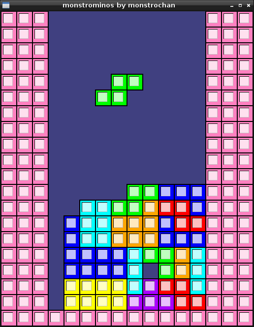
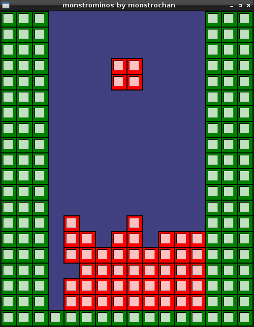
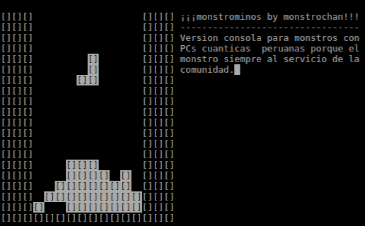
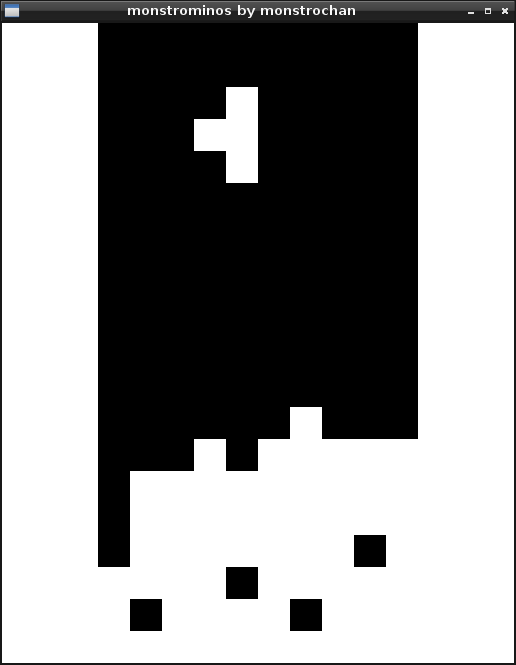
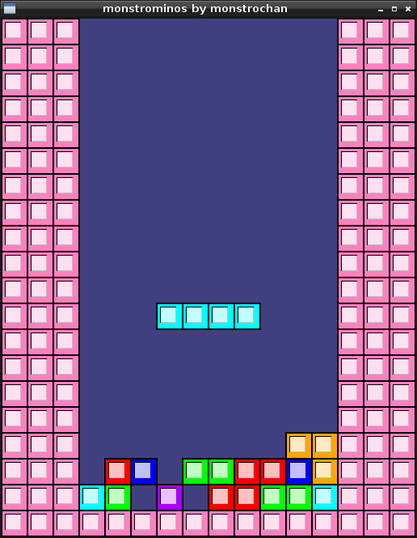
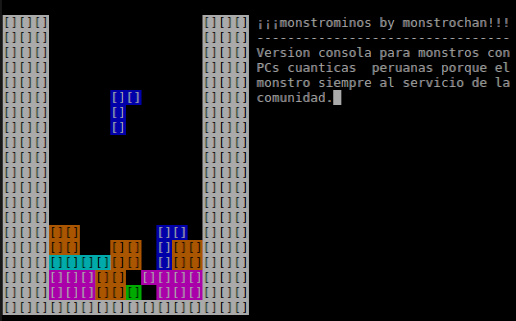

:octocat::octocat::octocat: Para leer la versión en español de este documento [haz click aquí](./LEEME.md). :octocat::octocat::octocat:

[](http://monstrochan.org/l/)
- - -
# monstrominos
#### *monstrominos* by *monstruosoft* by *monstrochan*

*monstrominos* is a tetrominoes based game (a.k.a. Tetris clone) that originated from the "Reto de la toja azul" challenge at [monstrochan.org](http://monstrochan.org/l/). This is a playable WIP but it's still missing lots of features.



The code is organized in three independent sections: *core*, *logic* and *input/graphics*.

## Core
A minimal set of functions using pointer arithmetic to perform the basic actions of placing pieces on the playfield, checking for completed lines and remove them accordingly. Playfield size is hardcoded as an array of 24 `uint16_t` representing 24 rows 16 columns each. While these values are hardcoded, they are enough for any typical playfield implementation in a Tetris clone.

## Logic
This is where the actual gameplay takes place. The accompanying logic implementation is just one possible way to define the gameplay. Notice that you can write a totally different logic implementation and use the core functions for updating the playfield. There's still room for improvement in the accompanying sample logic implementation but it does already support basic wall and floor kicks as well as some -but not all- spins.

Also, keep in mind that, the core being minimal, the logic must handle its own way to support color. The accompanying logic provides an optional example to support colors.

## Inputs and Graphics
Making the accompanying logic implementation independent from the final library used for handling inputs and graphics allows for the logic to be reused with different libraries. Included in the repository are two different versions of the game, one using [Allegro 5](http://liballeg.org/) and one console version using *ncurses*. Both versions use the same core and logic by transforming the user inputs into the corresponding input flags used by the logic, updating the playfield using the core/logic functions and drawing the resulting playfield.

- - -

## Building
On Linux, the included `CMakeLists.txt` should build the project given that the necessary libraries are installed on your system.

* Make sure you have the required packages installed:
  * **CMake**
  * **Allegro 5** development files (for the Allegro 5 version)
  * **OpenGL** development files (for the Allegro 5 + OpenGL version)
  * **ncurses** development files (for the console version)
* Create a *build* directory inside the project directory and build it using *CMake + make*:
```
monstruosoft@PC:~$ cd monstrominos
monstruosoft@PC:~/monstrominos$ mkdir build
monstruosoft@PC:~/monstrominos$ cd build
monstruosoft@PC:~/monstrominos/build$ cmake ..
monstruosoft@PC:~/monstrominos/build$ make
```
- - -
There are three different versions that can be built by passing the corresponding argument to CMake. The following will build the default 1bpp version of the game:
```
monstruosoft@PC:~/monstrominos/build$ cmake ..
```
 

- - -
Passing `-DWANT_OPENGL` to CMake will build the Allegro 5 version using OpenGL to draw the actual playfield as a 1bpp texture:
```
monstruosoft@PC:~/monstrominos/build$ cmake .. -DWANT_OPENGL
```

- - -
Passing `-DWANT_COLORS` to CMake will build both the Allegro 5 and the ncurses versions with color support:
```
monstruosoft@PC:~/monstrominos/build$ cmake .. -DWANT_COLORS
```



Note that if your terminal supports 256 colors, the ncurses version will attempt to use proper colors:


## Planned Features
- [x] SRS rotation
- [x] Spins
- [ ] Title screen
- [ ] Scoring system
- [ ] Multiplayer
- [ ] Backgrounds
- [ ] Special effects
